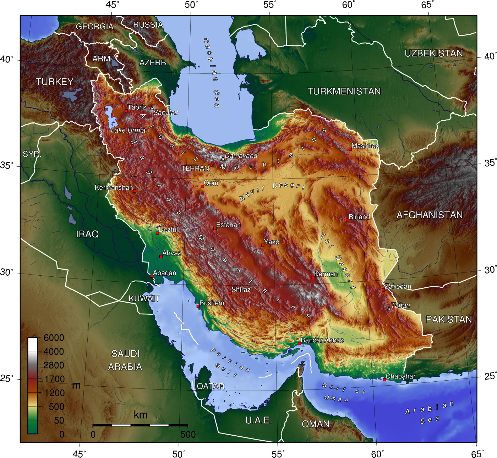

# 何为地图
地图是现实世界的映射（map）。它不是现实世界，但加深了我们对世界的理解。

# 3A能力
制作一幅地图需要三种能力：Abstract, Attention, Attitude.

## Abstract：抽象能力

   一幅遥感影像不是地图，人类不可能事无巨细观看到每个角落的细节。

   地图是需要经过概括抽象，将纷繁复杂的三位现实世界，展现在二维介质。
   
   道路河流简约成线条，村庄缩小为点，疆域显示为面，地形起伏通过等高线表示。

   抽象让我们思考更复杂的事物。
   

## Attenion：专注与取舍

注意力永远是稀缺的，因此制图时只能有所取舍。

不同角色对现实世界的关注点是不一样的：

- 军事家关心地形起伏

  

- 消费者关心餐厅分布

- 流行病学家关注病例空间分布（John Snow, 1854）

  

每个人的关注范围和精度需求是参差的，也因此产生了不同分辨率不同专题的地图。

> 90%的信息都是垃圾。

这句话在这个时代依然成立。随着各类内容的爆炸增长，现在可以说**99%的信息都是垃圾**。

## Attitude：态度与价值观

地图是人的产物，不可避免会混入人类的价值观。如以北为上。

<u>地图是工程和艺术的结合。</u>

# 关于地图，你需要注意的事情

- 地图会骗人
  - 制图综合：为了地图的可读性，对地理数据进行的主动且合理的“失真”处理。

  
     如果按比例尺测算，常规全国地图上河流和道路的宽度甚至可达2-3km，远超其真实值（数米到数十米）
     
     
     
     为了避免将关键信息消失于背景，也为了照顾人类有限的认知，地图提供的是有选择性的，不完整的现实视图。
     
     
     要制作有用的地图，地图必须撒谎。
     

   - 降维压缩的信息损失
     
     从高维向低维进行信息压缩，必然是有损的。
     
     这是地图无法避免的局限性。不可能在二维世界重建三维平面，这种尝试本质上如同将完整的橘子皮强行拍平，必然会出现拉扯变形。
     
     因此我们会看到
     
     - 格陵兰岛（210万平方千米）看起来和非洲大陆（3000万平方千米）一样大
       
     - 地球仪上弯曲的等角航线变为直线
     

     
   # 一个比喻

  地图是一种通用的语言和跨文化交流工具，且地图也是一种对物理世界的抽象。借助地图，可以方便我们了解LLM对于人类知识的抽象。

  - LLM是对人类语言智能的压缩，并不代表它理解语言。正如同你从地图的一侧跨越到另一侧，不代表你进行了环球旅行。
 
  - 地图对世界的抽象可以让我们理解更复杂的事物，如等高线便于地理学家分析河流的形成机制。
     
     LLM对知识的抽象也让我们对 什么是智能 有了更深入的理解。
