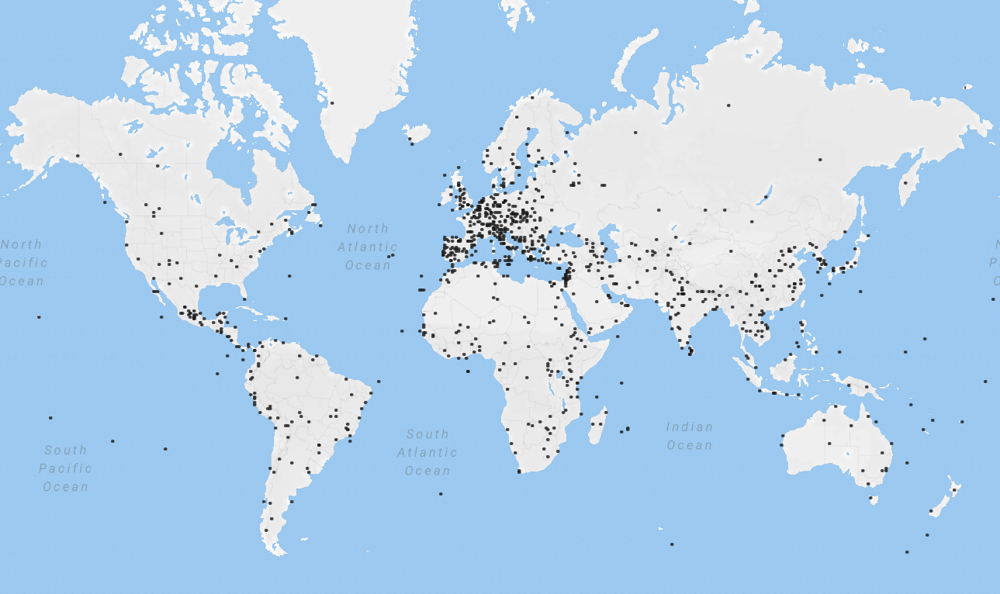
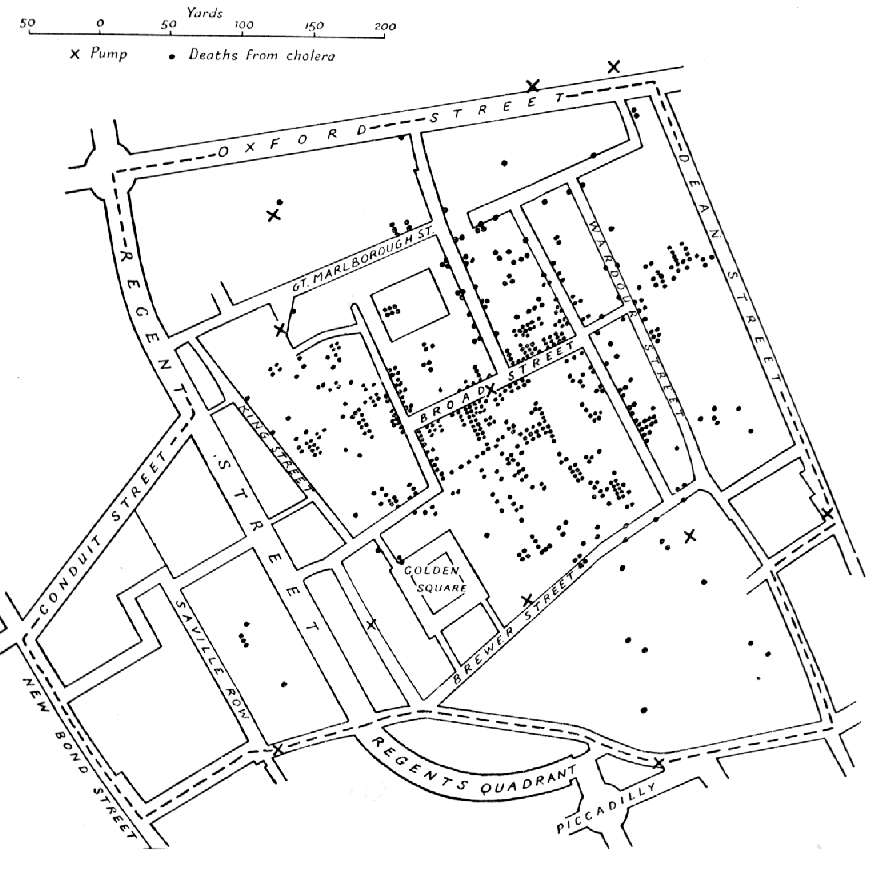
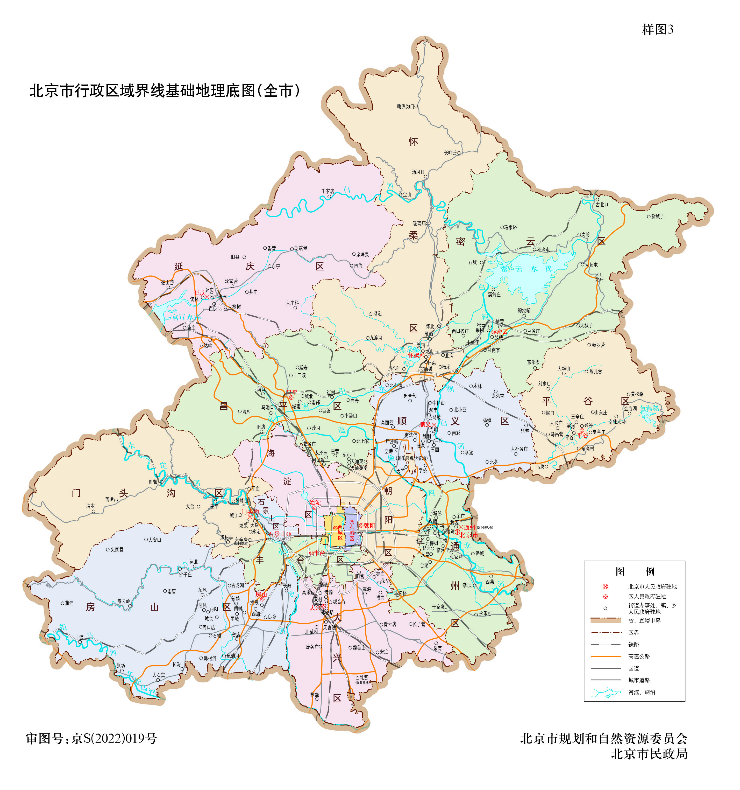
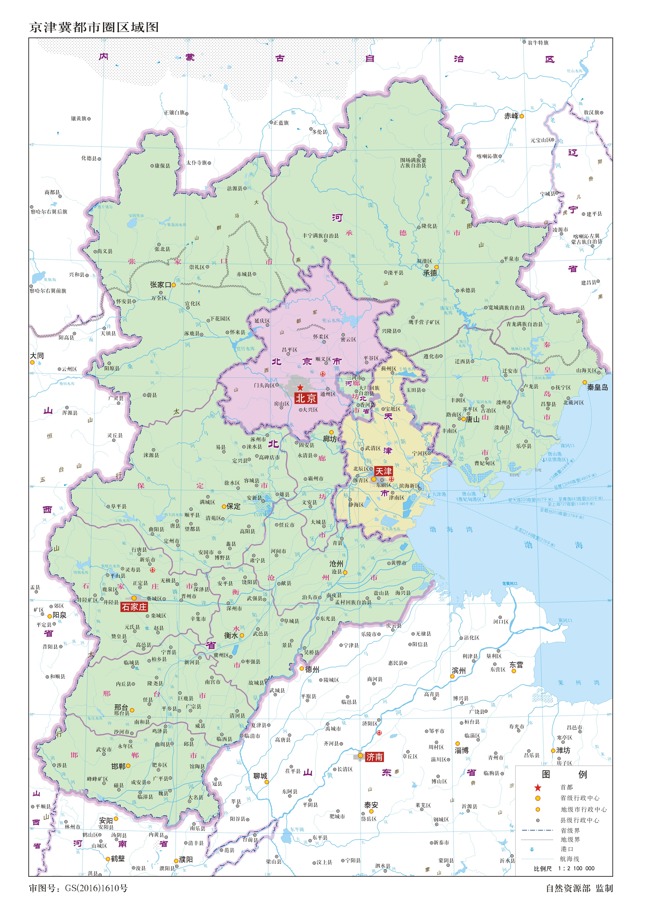

# 何为地图（Map the World）

地图是现实世界的映射（map）。它不是现实世界，但能加深我们对世界的理解。

## 目录

- [3A 能力](#3a-能力)
- [关于地图，你需要注意的事情](#关于地图你需要注意的事情)
- [一个比喻：地图与 LLM](#一个比喻地图与-llm)

## 3A 能力

制作一幅地图需要三种能力：Abstract、Attention、Attitude。

### Abstract：抽象能力

一幅遥感影像不是地图，人类不可能事无巨细地看到每个角落的细节。

  

地图需要经过概括与抽象，把纷繁复杂的三维现实世界展现在二维介质上：道路河流简约成线条，村庄缩小为点，疆域显示为面，地形起伏通过等高线表示。

抽象让我们得以思考更复杂的事物。

### Attention：专注与取舍

注意力永远是稀缺的，因此制图时只能有所取舍。不同角色对现实世界的关注点不一样：

- 军事家关心地形起伏  
  

- 消费者关心餐厅 / 点位分布  
  

- 流行病学家关注病例空间分布（John Snow, 1854）  
  

### Attitude：态度与价值观

地图是人的产物，不可避免会混入人的价值观（例如“以北为上”）。

> 90% 的信息都是垃圾。  
> 在内容爆炸的时代，这句话甚至可以改成：99% 的信息都是垃圾。

因此，一张好地图不追求“包含一切”，而追求“让关键信息被看见”。

**地图是工程和艺术的结合。**

## 关于地图，你需要注意的事情

### 地图会“骗人”

制图综合：为了地图的可读性，对地理数据进行主动且合理的“失真”处理。

如果按比例尺测算，常规全国地图上河流和道路的宽度甚至可达 2–3km，远超其真实值（数米到数十米）。

  

为了避免关键信息消失于背景，也为了照顾人类有限的认知，地图提供的是有选择性的、不完整的现实视图。要制作有用的地图，地图必须撒谎。

降维压缩的信息损失同样不可避免：从高维向低维进行信息压缩，必然是有损的。典型现象包括：

- 格陵兰岛（210 万平方千米）看起来和非洲大陆（3000 万平方千米）一样大
- 地球仪上弯曲的等角航线在平面地图上变为直线

### 分辨率与尺度

每个人的关注范围与精度需求是参差的，因此会产生不同分辨率、不同专题的地图：

<table>
  <tr>
    <th>城市群</th>
    <th>城市</th>
    <th>城区</th>
  </tr>
  <tr>
    <td></td>
    <td></td>
    <td></td>
  </tr>
</table>

## 一个比喻：地图与 LLM

地图是一种通用语言和跨文化交流工具，也是对物理世界的抽象。借助地图，我们也可以更容易理解 LLM 对人类知识的“抽象”：

- LLM 是对人类语言智能的压缩，并不代表它理解语言；正如你从地图的一侧跨越到另一侧，不代表你进行了环球旅行。
- 地图对世界的抽象可以帮助我们理解更复杂的事物（例如等高线便于分析河流的形成机制）；LLM 对知识的抽象也让我们对“什么是智能”有更深入的理解。
