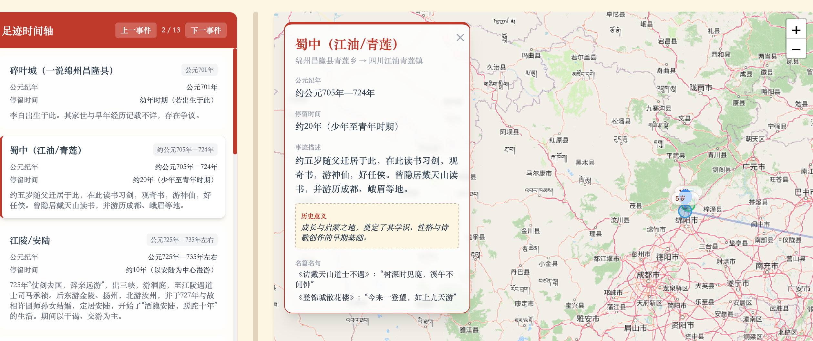

# 崔子橙

现任某互联网大厂数据运营职位，探索 AI中，提升生命厚度...

- 电话：[15510522509](tel:15510522509)
- 邮箱：[cuizicheng.1024@gmail.com](mailto:cuizicheng.1024@gmail.com)
- GitHub：[cuizicheng1024](https://github.com/cuizicheng1024)

## 个人简介

- 中科院地理所硕士
- 豆包「一点也不技术」创作挑战赛：铜奖
- 中关村北纬龙虾大赛：三等奖
- 上地街道智能体创新大赛：二等奖
- 大钟寺人工智能先导区青年夜校讲师
- Coze Skill 开发者
- 超脑 AI 公益导师

## 标签

- 标签：INTJ、天蝎座、导游、人工智能训练师、PMP
- 近期关注：AI 产业、阅读、历史地理、诗词、个人的 100 件小事
- 工作内容：Agent 落地；工作背景集中在地图、搜索、数据标注/评测等领域

## 技术文档

| 项目名称 | 简介 | 链接 |
| --- | --- | --- |
| Workflow 搭建技巧 | 用好工作流，效率翻倍 | [Workflow 搭建技巧](https://bytedance.larkoffice.com/wiki/Cgbew57gvisJphkGak4cBOEonzd) |
| OpenClaw 操作指南 | 从入门到精通，带你掌握龙虾玩法 | [OpenClaw 操作指南](https://shanzhuyicheng.feishu.cn/wiki/TJTJwITMKiSnyNkQOxJcULv0nSf) |

## 课程与授课

| 类型 | 难度 | 课程名称 | 课程简介 | 工具 | 场景 |
| --- | --- | --- | --- | --- | --- |
| 理论课 | 初级 | 大模型入门通识：概念篇 | 介绍大模型领域基础概念，为后续进阶课程打基础：大语言模型、Token、提示词、Workflow、智能体、Vibe Coding 等。 | — | 通识 |
| 实战课 | 初级 | 实战：小红书爆款内容生成 | 一键生成小红书爆款标题、文案与图片，实现矩阵号内容的批量生产。 | Refly、Coze | 自媒体行业 |
| 实战课 | 中级 | 豆瓣电影信息批量获取 | 完成豆瓣高分电影信息获取与词云分析，开启爬虫实践。 | Trae | 批量数据获取 |
| 理论课 | 中级 | LangGraph 入门：从拖拽到代码 | 讲解 LangGraph 设计理念与 Demo 测试。 | Trae、LangGraph | 搭建生产级 Agent |
| 理论课 | 高级 | OpenClaw 入门：一起玩龙虾 | 理解 OpenClaw 是什么，以及如何用好 OpenClaw。 | OpenClaw | 智能体工具链 |
| 实战课 | 高级 | OpenClaw 配置：打通 IM 接口 | 安装 OpenClaw（火山引擎/扣子/智谱），并为 OpenClaw 打通飞书 IM 接口。 | OpenClaw、飞书 | 企业协作接入 |
| 实战课 | 高级 | OpenClaw 配置：LLM 基座 | 常用海内外模型基座与 OpenClaw 的模型配置方案。 | OpenClaw | 模型接入配置 |
| 实战课 | 高级 | OpenClaw 配置：技能安装 | Skill 格式、获取方式与配置准则。 | OpenClaw | 技能体系搭建 |
| 实战课 | 高级 | OpenClaw 配置：安全风控和社区生态 | 讲解 OpenClaw 四层安全机制。 | OpenClaw | 安全与风控 |
| 实战课 | 高级 | OpenClaw 应用：打造你的专属主力 | Skill 配置与 ClawHub 应用实战。 | OpenClaw、ClawHub | 内容创作 |

## Side Projects

| 项目名称 | 简介 | 体验地址 | 截图 |
| --- | --- | --- | --- |
| 故事地图 | 从空间视角重新发现历史人物的时空关联 | [故事地图](https://github.com/cuizicheng1024/map_story_poster) |   |
| 陆游记 | 为在大陆发展的台湾同胞提供连接社群 | [陆游记](https://bytedance.larkoffice.com/wiki/GS1tw0yvCiqazKkhbHAcxmFunCS) | - |
